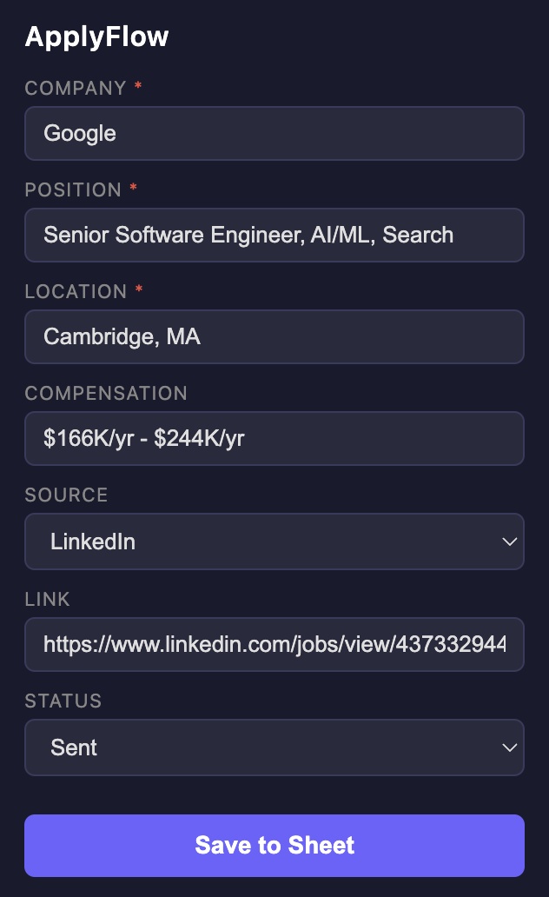
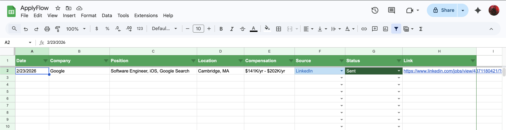

# ApplyFlow

A Chrome extension that automatically scrapes job postings and saves them to a formatted Google Sheets spreadsheet — so you can track every application without copying and pasting.

## Features

- **Auto-fills from the page** — detects company, position, location, compensation, and source from job postings
- **One-click save** — sends the entry data directly to your Google Sheet
- **Google Drive Integration** — creates automatically on your first save with color-coded headers, dropdowns, which can be customized
- **Duplicate detection** — warns you if you've already tracked a job listing / URL
- **Page detection** — warns you if the current page doesn't look like a job listing, but still lets you save manually
- **Multiple locations support** — detects and labels jobs with many office locations
- **Works on** — LinkedIn, Handshake, IBM, Amazon, and most company career pages

## Demo

**1. Find a job posting and open its specific listing page.**


**2. Click the ApplyFlow icon from your extensions — it automatically fills in the key fields.**



**3. On your first save you'll be prompted to sign in with Google.** Once approved, an **ApplyFlow** spreadsheet is created in your Google Drive automatically. You won't be prompted again.

**4. Your application is now tracked in the sheet!**



## Installation

This extension is not yet on the Chrome Web Store. Load it manually as an unpacked extension:

1. Clone or download this repository
   ```
   git clone https://github.com/dvaidwho/applyflow.git
   ```
2. Open Chrome and go to `chrome://extensions`
3. Enable **Developer mode** (toggle in the top-right corner)
4. Click **Load unpacked** and select the project folder
5. Note the **extension ID** shown under the extension name (you'll need it in the next step)
6. The ApplyFlow icon will appear in your toolbar

### Google Cloud Setup

Because this extension uses the Google Sheets API, you need to set up your own Google Cloud project and link it to your local extension ID.

1. Go to [Google Cloud Console](https://console.cloud.google.com) and create a new project
2. Navigate to **APIs & Services** > **Library** and enable the **Google Sheets API**
3. Go to **APIs & Services** > **Credentials** and click **Create Credentials** > **OAuth 2.0 Client ID**
4. Set the application type to **Chrome Extension** and enter your extension ID from step 5 above
5. Copy the generated **Client ID**
6. Open `manifest.json` and replace the `client_id` value with your own:
   ```json
   "oauth2": {
     "client_id": "YOUR_CLIENT_ID_HERE",
     "scopes": ["https://www.googleapis.com/auth/spreadsheets"]
   }
   ```
7. Reload the extension in `chrome://extensions`

> **Note:** If you ever remove and re-add the extension, Chrome will assign a new extension ID and you'll need to update it in Google Cloud Console under your OAuth credential's authorized origins.

## Setup

To clear the linked sheet and start fresh, open the Chrome DevTools console and run:
```js
chrome.storage.local.clear()
```

## Project Structure

```
applyflow/
├── manifest.json          # Extension config (Manifest V3)
├── popup/
│   ├── popup.html         # Extension UI
│   ├── popup.css          # Styles
│   └── popup.js           # UI logic, save button, auth
└── utils/
    ├── parser.js          # Page scraper (runs inside the tab)
    └── sheets.js          # Google Sheets API calls
```

## Tech Stack

- Chrome Extension Manifest V3
- Vanilla JS (ES Modules)
- Google Sheets API v4
- Google Identity (OAuth2 via `chrome.identity`)

## Contact
- Email: [Kongndavid@gmail.com](mailto:Kongndavid@gmail.com)
- Linkedin: [https://www.linkedin.com/in/davidnkong/](https://www.linkedin.com/in/davidnkong/)
- Github: [https://github.com/dvaidwho](https://github.com/dvaidwho)
